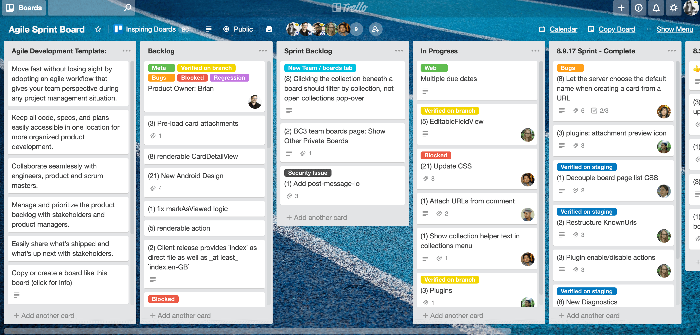
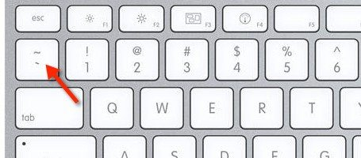

# Peer to Peer Coaching Session

This repo contains HTML, CSS and JavaScript files that are used for peer to peer coaching sessions.
<hr>
## Session - 2 : Wednesday 1 December 21

- **_Resources_**
- [VS Code extensions list ](https://javascript.plainenglish.io/a-guide-to-the-20-best-vscode-extensions-for-frontend-developers-f75a5d716091)
- [Useful VS Code extensions](https://www.blog.duomly.com/13-useful-vs-code-extensions-for-front-end-development/)
- Open Gitbash within VS Code
  - [Integrated Terminal](https://code.visualstudio.com/docs/editor/integrated-terminal)
  - [Second answer post with 410 rating](https://stackoverflow.com/questions/42606837/how-do-i-use-bash-on-windows-from-the-visual-studio-code-integrated-terminal)
- [HTML characters entities](https://dev.w3.org/html5/html-author/charref)

<hr>

## Session - 3 : Wednesday 8 December 21

- Instruction format : window (*mac*)

|No| Command                       | Explanation                                |
| ---|----------------------------- | ------------------------------------------ |
|1|**Ctrl (Command)+ Shift + P**| Displays the command pallete. Command Palette provides access to many commands. You can execute commands|
|2|Ctrl (Command) + P| Display the search bar to search for files in the project|
|3| Alt (option) + select the text line | You can type same thing in multilple lines. It saves you time |
|4|window(command) + ;| To get emoji🙌🚉✈🛤🗾🗺😉😿|
|5|shift + Alt (option) + ⬇ or ⬆|Copy the current line to one line up or one line below|
|6|Alt(option) + ⬇ or ⬆|Move the current line without copying to the place you want to move|
|7|Ctrl (command) + B| Toggle the sidebar - show or hide the side bar where you can navigate through the explorer|
|8|Ctrl (command) + Shift + E| Move to Explorer window where you have your file tree and can navigate using the arrow keys.|
|9|Ctrl (command) + Shift + L| Multi cursor selection - Add additional cursors to edit all occurrences of the current selection. Usually less error-prone than doing search and replace all.|
|10|Ctrl (command) + D|One by one selection : use Ctrl + D if you want to add the occurrences of the current selection one by one. Each time you press the key combination it adds a new occurrence to the selection.|
|11|Ctrl (command) + /|Toggle between commented and uncommented line behavior|
|12|Ctrl (command) + Spacebar|Shows suggestions to quickly fill properties and other stuff.|
|13|Ctrl (command) + j or `| Toggle Terminal/Output/Debug Console view|
|14|Shift + Alt (option) + ⬇ or ⬆ | Copy the current line|
|15|Shift + Ctrl (command) + K |Remove the current line|
|16|Ctrl + K + C| Comment lines selected|
|17|Ctrl (command) + Shift + \| Go to matching bracket|


- **_References_**
  - [CSS Fonts](https://www.cssfontstack.com/)
  - VS Code Shortcut
    - [10 useful VS Code shortcuts you should know ()](https://dev.to/simonpaix/10-useful-vs-code-shortcuts-you-should-know-42m)
    - [Setup VS Code](https://dev.to/yogeshdev/setup-vs-code-for-designer-and-front-end-developers-1fli)
    - [15 Useful VS Code Shortcuts to Boost Your Productivity](https://betterprogramming.pub/15-useful-vscode-shortcuts-to-boost-your-productivity-415de3cb1910)
    - [11 VSCode Keyboard Shortcuts that will Boost your Productivity](https://www.desuvit.com/11-vscode-keyboard-shortcuts-that-will-boost-your-productivity/)
    - [21 VSCode Shortcuts To Code Faster and Funner](https://jsmanifest.com/21-vscode-shortcuts-to-code-faster-and-funner/)
    - [42 Visual Studio Code Shortcuts for Boosting Your Productivity](https://www.sitepoint.com/visual-studio-code-keyboard-shortcuts/)
    - [HTML semantics cheat sheet](https://learn-the-web.algonquindesign.ca/topics/html-semantics-cheat-sheet/)
    - [HTML Cheatsheet](https://web.stanford.edu/group/csp/cs21/htmlcheatsheet.pdf)

<hr>

## Session - 4 : Wednesday 15 December 21

**Learning Objectives**
- [Trello - Example of Agile Sprint Board](https://trello.com/)
- 
- README.md file 

|No| Element                      | Explanation                                |
| ---|----------------------------- | ------------------------------------------ |
|1|Heading level 1| # h1|
|2|Heading level 2| ## h2|
|3|Heading level 3| ### h3|
|4| Bold text | **bold text** |
|5| Bold text | __bold text__ |
|6| Italic text |*bold text* |
|7| Bold and Italic text | ***bold text*** |
|7.1| Strikethrough | ~~This text is a mistake. To be deleted~~ |
|8| Block quote | > prepare the materials|
|9| Multiple blockquotes| > Add > in multiple lines |
|10| Nested blockquotes | >> This is nested blockquotes. |
|11| Blockquotes with heading| > ### This is excellent! |
|12| Blockquotes with list| > - This is excellent! |
|13| Ordered List| 1. First Item 2. Second Item |
|14| Unordered List| - First item - Second Item or * First Item * Second Item|
|14.1| Combine Ordered and Unordered List| 1. First item 2. Second Item * Item 1 * Item 2|
|14.2| Task Lists| - [x] Completed|
|14.2| Task Lists if the description begins with a parenthesis()| - [x] \(Optional) task|
|15| Images| |
|16| Images resize using html img tag| |
|17| Backticks |  |
|17| Add code to markdown using backticks | `Use backticks for code : <p>Save the document by pressing </p>` |
|17.1| Add block of code or quotes | ```git status git add git commit``` |
|18| Horizontal Rules| *** or --- or ____________ or <hr>|
|19| Add hyerlink| [Google](https://www.google.com/)|
|20| URL and email addresses links| <https://www.google.com/>, **<testing@google.com>** |
|21| Link | <details><summary>Link</summary>In a hole in the ground there lived a hobbit. Not a nasty, dirty, wet hole, filled with the ends of worms and an oozy smell, nor yet a dry, bare, sandy hole with nothing in it to sit down on or to eat: it was a [hobbit-hole][1], and that means comfort.  Add this in a separate link. [1]: <https://en.wikipedia.org/wiki/Hobbit#Lifestyle> "Hobbit lifestyles"</details>|
|22| Add relative links for headings| [***Open Source Contribution for Beginners***](#open-source-contribution-for-beginners) |
|23| Mention people and team on Github| use @username |
|24| [Use emoji](https://gist.github.com/rxaviers/73609080)| :EMOJICODE:  , :smile:|
|25|[Footnote](https://github.blog/changelog/2021-09-30-footnotes-now-supported-in-markdown-fields/)| This is my first footnote[^1].  [^1] : My reference|
|26| [Create a collapsed section](https://docs.github.com/en/github/writing-on-github/working-with-advanced-formatting/organizing-information-with-collapsed-sections)| <details><summary>Collapsed Section</summary>This is to create a collapsed section</details>|
|27|[Table](https://docs.github.com/en/github/writing-on-github/working-with-advanced-formatting/organizing-information-with-tables)|See this table|

<details>
<summary>References</summary>

  - [Markdown List](https://www.markdownguide.org/tools/github-pages/)
  - [Basic writing and formatting syntax](https://docs.github.com/en/github/writing-on-github/getting-started-with-writing-and-formatting-on-github/basic-writing-and-formatting-syntax)
  - [Advanced Formatting](https://docs.github.com/en/github/writing-on-github/working-with-advanced-formatting/organizing-information-with-tables)
  - [Markdown Cheatsheet](https://github.com/adam-p/markdown-here/wiki/Markdown-Cheatsheet#tables) 

</details>


<hr>

## Session - 5 : Wednesday 22 December 21

- ***CSS Bootstrap*** - Almost all of the components are done via class
- **Components**
  - [Alerts](https://getbootstrap.com/docs/5.1/components/alerts/)
    - class="alert alert-danger"
    - class="alert-heading"
    - Dismissing 
    - aria - is something to do with screenreader
  - [Badeges](https://getbootstrap.com/docs/5.1/components/badge/)
    - Badges can be used as part of links or buttons to provide a counter.
    - badge bg-secondary
    - `<span class="badge bg-secondary">4</span>`
  - [Buttons](https://getbootstrap.com/docs/5.1/components/buttons/)
    - btn is everywhere.
    - `<button type="button" class="btn btn-primary">Primary</button>`
    - primary, secondary, success, danger, warning, info, light, dark, link
    - Button tags
    - Outline buttons
  - [Button group](https://getbootstrap.com/docs/5.1/components/button-group/)
    - class="btn-group"
    - role="group" -> is for accessibility. It will tell the screenreader that this is a group of buttons
- **Content**
  - [Typography](https://getbootstrap.com/docs/5.1/content/typography/)
    - display class - 1 to 6 - are used to make large header
      - display-1
      - display-2
      - display-3
      - display-4
      - display-5
      - display-6 
    - class="lead" - make a paragraph stand out
    - class="blockquote"
    - class="blockquote-footer"
    - class="mb-0"
    - *Alignment* 
      - class="text-center"
      - class="text-end"
- **Layout**
  - [Containers](https://getbootstrap.com/docs/5.1/layout/containers/)
    - .container
    - .container-fluid
- **Utilities**- They do not stand alone. They are added onto something.
    -   [Colors](https://getbootstrap.com/docs/5.1/utilities/colors/)
      - text-primary - change text color
    - [Background](https://getbootstrap.com/docs/5.1/utilities/background/)
        - bg-primary - change background colour

<hr>

## General Resources

### **_HTML_**
- [HTML characters entities](https://dev.w3.org/html5/html-author/charref)
- [Emmet HTML cheatsheet](https://docs.emmet.io/cheat-sheet/)

### ***CSS***

- [Trending color palettes](https://coolors.co/palettes/trending)
- [A Complete Guide to Flexbox](https://css-tricks.com/snippets/css/a-guide-to-flexbox/)
- [https://css-tricks.com/the-css-box-model/](https://css-tricks.com/the-css-box-model/)
- [A Complete Guide to CSS Media Queries](https://css-tricks.com/a-complete-guide-to-css-media-queries/)
- [9 basic principles of responsive web design](https://blog.froont.com/9-basic-principles-of-responsive-web-design/)

### ***JavaScript***

- [The Modern JavaScript Tutorial](https://javascript.info/)
#### Object Oriented Programming
- [JavaScript Object Oriented Programming by Bogdan Stashchuk](https://www.udemy.com/course/object-oriented-programming-javascript/)
- [Advanced and Object Oriented JavaScript and ES6](https://www.udemy.com/course/advanced-and-object-oriented-javascript/)
- [Design Patterns in JavaScript](https://www.udemy.com/course/design-patterns-javascript/) 
- [JavaScript Object-Oriented Masterclass](https://www.udemy.com/course/javascript-object-oriented-masterclass/)
### ***GitHub README File***


### ***Open Source Contribution for Beginners***
- [Good First Issues ](http://goodfirstissues.com/)
- [good first issue](https://goodfirstissue.dev/)
- [LibHunt](https://www.libhunt.com/topic/good-first-issue)
- [good-first-issue ](https://github.com/topics/good-first-issue)
- [First Timers Only](https://www.firsttimersonly.com/)